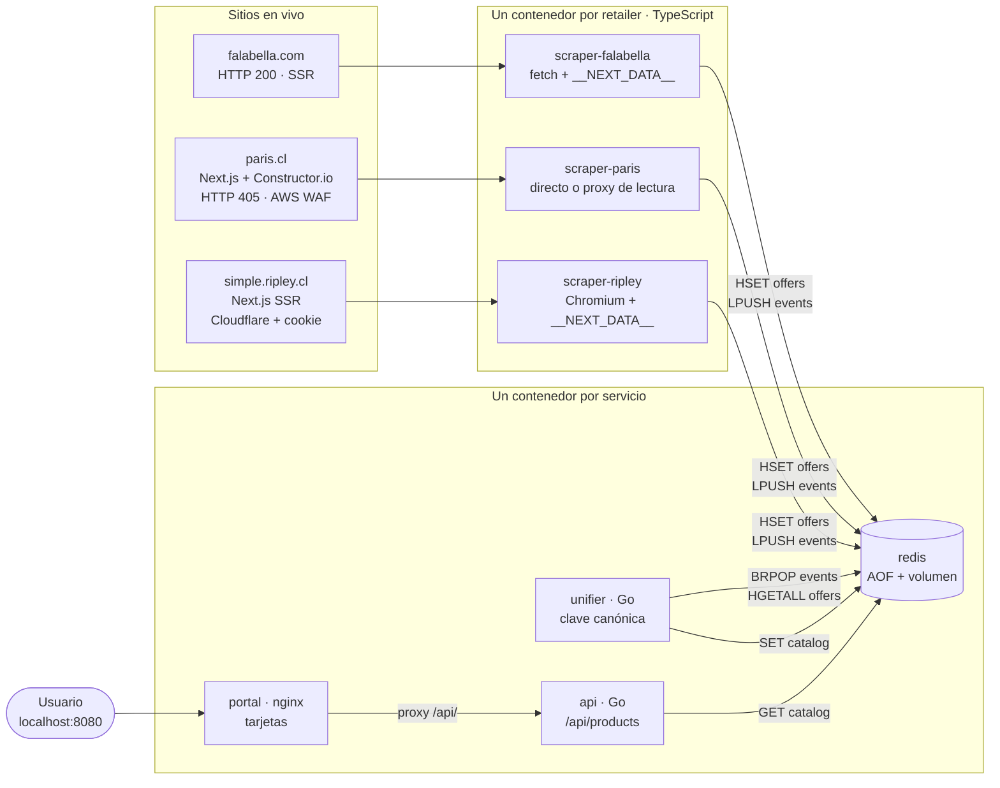

# ChileCompara

Comparador de precios de smartphones para el mercado chileno. Obtiene productos
en vivo desde **Falabella, Paris y Ripley**, reconoce cuándo un mismo teléfono
aparece en más de una tienda aunque cada sitio lo nombre distinto, y lo muestra
en una sola pantalla con el precio de cada retailer y el más barato destacado.

> **Estado hoy:** los tres retailers entregan datos en vivo. En la última
> medición, **32 productos se pueden comparar entre tiendas y 7 aparecen en las
> tres**. Paris se lee a través de un proxy público y Ripley necesita una cookie
> de sesión renovada a mano: ambas cosas están explicadas abajo y se muestran en
> el portal, no se disimulan.

Todo corre local con un comando, sin cuentas ni infraestructura en la nube:

```bash
docker compose up --build
```

Luego abre **http://localhost:8080**.

**Con eso ya ves dos tiendas.** Falabella y Paris funcionan sin configurar nada.
Ripley necesita un paso manual de treinta segundos, porque Cloudflare exige que
un navegador real pase su challenge: está en [Configurar Ripley](#configurar-ripley-la-tercera-tienda),
justo debajo. Sin ese paso el portal no se rompe: muestra *Ripley: sin datos* y
compara las otras dos.

Dos matices de honestidad que conviene leer antes que el código, porque un
"corre local sin dependencias" a secas sería inexacto: el scraper de Paris cae
hoy a un **proxy de lectura público** (`r.jina.ai`) porque su WAF nos sirve un
CAPTCHA, y Ripley depende de esa **cookie manual que caduca en ~30 minutos**.
Ninguna de las dos es una cuenta ni una clave de API, y ambas se declaran en el
portal; pero llamar a esto "sin dependencias externas" sería vender el sistema
por más de lo que es. Están en [Limitaciones conocidas](#limitaciones-conocidas)
con su razón y su coste.

### Configurar Ripley (la tercera tienda)

```bash
cp .env.example .env      # y sigue las instrucciones que trae dentro
docker compose up -d --force-recreate scraper-ripley
```

`.env.example` documenta las tres variables y cómo obtener cada una. El resumen:

| Variable | Para qué | Cómo se obtiene |
|---|---|---|
| `RIPLEY_CF_COOKIE` | Pasar el challenge de Cloudflare | Abre [el listado de Ripley](https://simple.ripley.cl/search/smartphones?sort=relevance_desc&page=1), espera a que cargue, F12 → Application → Cookies → filtra `cf_clea` → copia el **Value**. Úsalo como `cf_clearance=<valor>` |
| `SCRAPER_UA` | Cloudflare ata la cookie al navegador que la obtuvo; con otro User-Agent la rechaza | En la consola del navegador: `navigator.userAgent` |
| `PARIS_WAF_COOKIE` | *Opcional.* Leer Paris directo en vez de por el proxy | F12 → Application → Cookies → `aws-waf-token`, tras resolver el CAPTCHA a mano |

Comprueba que entró:

```bash
docker compose logs --tail 5 scraper-ripley   # -> "scrape ok: N ofertas"
curl -s localhost:8081/api/status              # -> ripley "ok": true
```

Si Ripley dice `ok: false`, casi siempre es que la cookie caducó: repite el
`cp`/pega y recrea el contenedor.

La API queda en `http://localhost:8081/api/products` por si quieres ver el JSON
crudo, y `http://localhost:8081/api/status` dice qué scraper respondió y cuál no.

## Resultado

**Medido el 29/08/2026 a las 12:36 contra los catálogos en vivo: 143 productos, 226 ofertas,
32 comparables entre tiendas y 7 presentes en las tres.**

> Estas cifras son una **fotografía**, no una constante. Los scrapers repiten
> cada 15 minutos y el inventario de las tiendas rota: entre dos lecturas
> separadas por diez minutos el catálogo pasó de 168 a 143 productos porque
> Ripley cambió lo que publica. Lo que no cambia es el mecanismo. Si el número
> de esta tabla no coincide con el que ves al levantarlo, la tabla está vieja,
> no rota: la verdad está en `http://localhost:8081/api/products`.

Los 7 productos que aparecían en Falabella, Paris y Ripley a la vez:

| Producto | Falabella | Paris | Ripley | Ahorro |
|---|---|---|---|---|
| Galaxy S26 Ultra 256 GB Black | **$1.099.990** | $1.249.990 | $1.219.990 | $150.000 |
| Redmi Note 15 Pro 5G 256GB | **$279.990** | $319.990 | $339.990 | $60.000 |
| Galaxy S25 256GB | $599.990 | **$549.990** | **$549.990** | $50.000 |
| IPhone 15 128 GB | $699.990 | **$669.990** | $719.990 | $50.000 |
| Redmi Note 15 5G 256GB | $279.990 | $269.990 | **$239.990** | $40.000 |
| 400 Smart 6+256GB | $209.990 | **$189.990** | $199.990 | $20.000 |
| G06 128GB | $94.990 | **$89.990** | **$89.990** | $5.000 |

**Cada tienda gana en algún producto**: en esta lectura Ripley es la más barata
en 15 comparaciones, Falabella en 11 y Paris en 6. Esa es exactamente la tesis
del cliente: no hay una tienda barata, hay un precio barato por producto, y sin
comparar no se ve.

La mayor diferencia del catálogo completo era de **$300.000** en el Galaxy S25 Ultra 256GB
(Falabella $849.990 vs Paris $1.149.990).

Y los iPhone cruzan pese a que Falabella los lista sin capacidad (`IPhone 15`,
sin GB): eso lo resuelve la fusión de dos niveles que se explica más abajo.

---

## Qué problema resuelve

El mismo teléfono cuesta distinto en cada retailer, y hoy no hay forma de verlo
sin abrir tres pestañas y comparar a mano títulos que nunca coinciden: uno lo
llama `Celular Galaxy S25 Ultra 256GB`, otro `Samsung Galaxy S25 Ultra 256 GB
Negro Titanio`. El trabajo duro no es bajar precios: es **decidir que esos dos
títulos son el mismo producto**, y hacerlo con reglas que también funcionen con
un teléfono que salga al mercado mañana.

---

## Arquitectura



**Flujo punta a punta.** Cada scraper obtiene el catálogo de su tienda y escribe
sus ofertas crudas en el hash `offers` de Redis, con la clave
`{retailer}:{sku}`; luego empuja el nombre del retailer a la lista `events`. El
`unifier` está bloqueado en `BRPOP events`: en cuanto llega un evento (o cada 5
segundos, si no llega ninguno) relee **todas** las ofertas, calcula la identidad
canónica de cada una, las agrupa y guarda el catálogo ya resuelto en la clave
`catalog`. La `api` sólo lee esa clave y la sirve; el `portal` es nginx con HTML
estático que hace `fetch` cada 10 segundos y hace de proxy hacia la API para que
el navegador vea un único origen.

**Los 7 nodos.** `redis` · `scraper-falabella` · `scraper-paris` ·
`scraper-ripley` · `unifier` · `api` · `portal`. Ningún contenedor mezcla dos
retailers ni dos responsabilidades: el que raspa no unifica, el que unifica no
sirve HTTP, y el que sirve la web no habla con Redis.

---

## Decisiones y por qué

### 1. Qué sitio necesita navegador, y por qué

Se midió antes de decidir nada, con `curl` y un User-Agent de Chrome:

| Sitio | Respuesta real | Necesita navegador |
|---|---|---|
| `falabella.com` | **HTTP 200**, 2.5 MB de HTML con `__NEXT_DATA__` y 56 productos dentro | **No** |
| `paris.cl` | **HTTP 405** + `<title>Human Verification</title>` con `window.gokuProps` y `awsWafCookieDomainList` | **Sí** |
| `simple.ripley.cl` | **HTTP 403**, shell `<html class="no-js">` de 140 KB, cero markup de producto | **Sí** (y además cookie de sesión) |

Son **dos**, no uno. Falabella se libra porque renderiza en el servidor con
Next.js y deja el catálogo entero serializado en el HTML: un GET basta. Paris
tiene AWS WAF delante del dominio completo — el interstitial aparece igual en la
API de VTEX, en el sitemap y en el árbol de categorías, así que no es cuestión
de encontrar el endpoint correcto. Ripley devuelve un cascarón cuyo contenido
sólo existe después de ejecutar su JavaScript.

### 2. Paris ya no es VTEX, y descubrirlo cambió el scraper entero

La primera versión llamaba a la API de catálogo de **VTEX**, que es lo que uno
espera de un retailer chileno grande. Estaba equivocada, y el error era sutil:
esos endpoints no están *bloqueados*, **ya no existen**. Medido —
`pariscl.vtexcommercestable.com.br` responde `400 "This store is temporarily
unavailable"` y el dominio público sirve `/_next/static/chunks/`. Paris migró a
**Next.js + Constructor.io**.

Los datos están en los atributos de analítica que Constructor.io deja en cada
tarjeta del listado: `data-cnstrc-item-name`, `-item-id`, `-item-price`. Eso es
metadata estructurada dentro del HTML — mejor que raspar texto, porque no depende
de clases CSS que cambian con cada rediseño.

Un detalle que parece menor y no lo es: se parsea la **etiqueta completa** y de
ahí sus atributos, en vez de recolectar cada atributo por separado y emparejarlos
por posición. Si una tarjeta llegara sin precio, el emparejamiento posicional
desplazaría todos los precios una fila y le asignaría a cada teléfono el precio
del siguiente. Ese fallo no rompe nada visible: sólo muestra precios falsos.

**Cómo se accede.** Dos vías, en este orden:
1. **Sitio directo** con navegador, usando una cookie de sesión si alguien pasó
   el CAPTCHA (`PARIS_WAF_COOKIE`).
2. **Proxy de lectura público** (`r.jina.ai`), que carga la URL con su propio
   navegador y devuelve el DOM renderizado.

La segunda entrega el catálogo real de Paris en el momento en que se pide — no
es una copia en caché ni un fixture — pero pasa por un **intermediario**, y eso
se declara: queda en el estado del scraper, se muestra en el chip del portal y
está escrito aquí. Presentarlo como acceso directo sería mentir sobre la
procedencia del dato.

### 3. La unificación no tiene una sola regla por producto

La clave canónica es `marca | modelo | almacenamiento | condición`. Todo lo que
la construye es un vocabulario de **atributos** — marcas, colores, ruido
comercial, unidades de ficha técnica — nunca una lista de modelos. Un teléfono
que no existe todavía se normaliza igual que uno conocido, y hay un test que lo
comprueba con un producto inventado.

Cuatro decisiones concretas, cada una nacida de un dato medido en el catálogo
real, no de una intuición. **Todos los porcentajes de abajo están medidos sobre
las 169 ofertas del catálogo unificado de hoy** — la primera versión de este
README los citaba sobre una sola página de Falabella y los presentaba como si
fueran del conjunto, que es una forma silenciosa de mentir con datos ciertos:

- **La marca sale del campo estructurado cuando existe, y del título cuando no.**
  El **26 %** de los títulos del catálogo (169 ofertas) no contiene ningún token
  de marca — `Celular 15T 512GB`, `Celular Edge 60 256GB` — y extraerla del texto
  fabricaba marcas falsas como `15t` o `edge`. Falabella publica `brand`
  estructurado en el **100 %** de sus ofertas; **Paris en ninguna**, así que sobre
  el 17 % del catálogo la marca sí sale del título, por el fallback de token. Los
  títulos de Paris siempre nombran la marca, así que ahí funciona — pero es la
  parte frágil del mecanismo, no la sólida.
- **El almacenamiento es el máximo de las capacidades, no la primera.** Los
  títulos mezclan RAM y ROM en cualquier orden: `8GB RAM+ 256GB Memoria` y
  `256GB (12GB RAM)` conviven en el mismo catálogo. Quedarse con el primer match
  devolvía 8 GB para un teléfono de 256 GB — un dato falso *y* una clave partida.
- **La condición entra en la clave.** El **14 %** del catálogo es reacondicionado
  (23 de 169; el 16 % de las ofertas de Falabella).
  Si colapsa con el producto nuevo, el portal anuncia un "más barato" que el
  usuario no puede comprar. Eso no es un bug de formato: destruye la única
  promesa que hace la pantalla.
- **Las ofertas sin capacidad se adhieren, pero sólo si no hay ambigüedad.** El
  **11 %** de los títulos no declara almacenamiento — y son justo los iPhone,
  que Falabella lista como `IPhone 17` a secas. Esas ofertas se unen al grupo que
  comparte marca, modelo y condición **si hay exactamente un candidato**. Con dos
  (256 GB y 512 GB) la oferta es genuinamente ambigua y se deja aparte: dos
  tarjetas separadas es honesto, adivinar no lo es.

### 4. Nunca se compara un precio con tarjeta de la tienda

Falabella publica `cmrPrice` y Ripley un precio "Tarjeta Ripley": exigen
contratar un producto financiero de esa misma tienda. Compararlos contra el
precio al contado de otra tienda inventa un ahorro que no existe. Se usa el
precio al contado (`internetPrice` / `eventPrice`, o el de oferta) y nada más.
Es una decisión de negocio, no de parsing.

**La reserva:** eso está *verificado* para Falabella y Ripley, donde el precio
con tarjeta viene en un campo aparte que descarto por nombre. En Paris el precio
llega en un único atributo y no comprobé que nunca traiga el precio Tarjeta
Cencosud. Está anotado en las limitaciones en vez de dejarlo implícito.

### 5. Falabella se sirve en ISO-8859-1

La página declara `<meta charSet="iso-8859-1">`. Decodificarla como UTF-8
convierte `Batería` en `Bater?a` y contamina los títulos, que son exactamente la
materia prima de la unificación. El scraper decodifica en `latin1`.

### 6. El catálogo se reconstruye entero en cada evento

Son unos cientos de filas: recalcular todo cuesta lo mismo que actualizar
incremental y elimina de raíz los bugs de estado parcial — la oferta retirada que
sobrevive, el precio viejo que gana. La complejidad se paga en la demo.

### 7. Un retailer bloqueado se muestra, no se esconde

Si un scraper no consigue datos, su contenedor sigue de pie, registra el motivo
en Redis y el portal lo dice en su cabecera. Un nodo caído es información para el
usuario, no algo que ocultar detrás de una pantalla vacía.

---

## Verificación

Todo esto se corre contra el sistema real, no contra la memoria de haberlo hecho.

```bash
# 1. Los 17 tests de unificación. No necesitas Go instalado.
docker run --rm -v "$(pwd)/unifier:/src" -w /src golang:1.23-alpine go test -v ./...

# 2. Qué respondió cada retailer, y por qué vía
curl -s localhost:8081/api/status

# 3. Persistencia real: el catálogo sobrevive a que se caiga todo.
#    Se levanta SÓLO Redis, sin ningún scraper que pueda repoblarlo.
docker compose down                 # sin -v: el volumen se conserva
docker compose up -d redis
docker compose exec redis redis-cli hlen offers    # > 0
docker compose exec redis redis-cli strlen catalog # > 0
docker compose up -d                # el resto

# 4. Que un tercero pueda levantarlo: clona en limpio y corre los tests.
git clone https://github.com/sdamianiw/chilecompara.git /tmp/cc && cd /tmp/cc
docker run --rm -v "$(pwd)/unifier:/src" -w /src golang:1.23-alpine go test ./...
```

El punto 4 no es decorativo: la primera versión de este repo **fallaba** ahí
porque `go.sum` estaba en el `.gitignore`, así que los tests pasaban en la
máquina donde se escribieron y en ninguna otra. Lo encontró una revisión
adversarial del entregable, no yo.

Los tests que más importan, porque cubren los errores caros:
`TestUnifyCrossRetailer` (tres tiendas, un teléfono, el más barato correcto) ·
`TestRefurbishedDoesNotUndercutNew` · `TestAmbiguousStorageDoesNotMerge` ·
`TestAccessoriesAndBundlesAreExcluded` · `TestScreenSizeDoesNotSplitTheProduct`.

## Limitaciones conocidas

Esta sección es tan importante como el resto del README. Declarar el límite de
lo verificado es más fiable que declarar cobertura total.

### 1. Los tres retailers funcionan, pero dos con una muleta

Ninguno de los tres se deja raspar de frente, y cada uno se resolvió distinto:

| Retailer | Defensa medida | Cómo se accede hoy |
|---|---|---|
| Falabella | ninguna | GET directo. Renderiza en servidor y embebe el catálogo en `__NEXT_DATA__` |
| Paris | **AWS WAF con CAPTCHA de imágenes** (`captcha.js`, "Let's confirm you are human"). Headless y headed con `xvfb-run`: ambos bloqueados | **Proxy de lectura público** (`r.jina.ai`), declarado en el portal |
| Ripley | **Cloudflare**: 403 y shell `class="no-js"` sin producto | **Navegador + cookie de sesión** que una persona obtiene una vez |

**Las dos muletas tienen coste y hay que decirlo:**

- **El proxy de Paris es un intermediario.** Entrega el catálogo real y del
  momento en que se pide — no es caché ni fixture — pero no es nuestra IP la que
  habla con Paris. Queda escrito en el estado del scraper y visible en el portal.
- **La cookie de Ripley caduca en ~30 minutos.** Medido en esta sesión: el
  scraper pasó el challenge, y un ciclo después volvió el interstitial "Un
  momento…". Sirve para una demo y para un pinchazo puntual; **no es una
  integración desatendida.**

**Y el hallazgo que costó tres intentos:** el bloqueo de Ripley no estaba donde
parecía. Primero, la ruta `/tecno/celulares/smartphones` está **muerta** — el
interstitial de Cloudflare tapaba un 404, así que parecía bloqueo cuando además
era una URL inexistente; la ruta viva es `/search/smartphones`. Segundo, con la
URL correcta y cookie, Cloudflare **sí se pasa**. Tercero, el listado lo pinta un
remote de **Module Federation** (`findabilitycomponent`) cuyos chunks internos
reciben 403 intermitente: el DOM queda vacío sin que nada parezca fallar, y sólo
monta un 30-40 % de las veces.

La solución fue **dejar de mirar el DOM**. El catálogo ya viene renderizado por
el servidor en `__NEXT_DATA__`, en `props.pageProps.findabilityProps.data
.products`, con marca, sku y precio como campos propios. Depender del HTML del
servidor en vez del render del cliente convirtió un scraper que acertaba una de
cada tres veces en uno determinista: **102 ofertas, todas las corridas.**

Se probó además `playwright-extra` con el plugin stealth, la mitigación estándar
contra la detección de automatización: **negativo en ambos sitios**, mismo
bloqueo en la misma etapa. Tiene sentido — stealth ataca huellas de
automatización, y aquí el obstáculo era un puzzle de imágenes y un challenge
gestionado en servidor. Las dependencias se revirtieron tras medirlo: un stealth
que no destraba nada es peso muerto.

### 2. Decisiones de unificación con coste conocido

- **La generación de red se descarta** (`5G`, `LTE`). Una tienda escribe "Redmi
  Note 15 Pro 5G" y otra "Redmi Note 15 Pro" para el mismo aparato, así que
  conservarla hundiría la tasa de cruce. El coste: un "Galaxy A17 LTE" y un
  "Galaxy A17 5G", que sí son modelos distintos, colapsan en una tarjeta.
- **Los números sueltos de ficha técnica sobreviven.** "Snapdragon 8 Elite Gen 5"
  pierde las palabras pero deja un "8" y un "5" en el modelo, lo que parte el
  Xiaomi 17 en dos tarjetas. Se intentó descartar números pequeños y el test de
  "Galaxy Z Flip 8" lo refutó: ahí el 8 **es** el modelo. Se revirtió a
  propósito — una tarjeta duplicada es un defecto menor que un nombre de producto
  destruido.
- **El vocabulario de marcas y colores es finito.** Una marca nueva cae al
  fallback (el primer token útil del título hace de marca), lo que funciona pero
  es más frágil que el campo estructurado. Un color que no esté en la lista
  parte la clave.

### 3. Cobertura del catálogo, y es desigual entre tiendas

Se leen 3 páginas de Falabella y 2 de Ripley, no el catálogo completo. **Paris
es el caso peor: una sola página por ruta, ~31 ofertas frente a ~150 de
Falabella y ~100 de Ripley.** Eso no sesga los precios que se muestran, pero sí
deprime el número de productos comparables: un teléfono que Paris vende y no
alcanzamos a leer aparece como si sólo estuviera en dos tiendas. Paginar Paris
es trabajo pendiente, no un límite del diseño.

### 4. Los totales fluctúan entre pasadas, y la causa es una decisión mía

Los tres nodos raspan cada 15 min con relojes independientes, así que el catálogo
siempre mezcla tres fotos tomadas a horas distintas. Pero la variación grande no
viene de ahí: **Ripley se pide con `sort=relevance_desc`, un ranking que la
tienda recalcula sola.** Pedir "las N páginas más relevantes" devuelve un
conjunto distinto de teléfonos en cada pasada, no los mismos con otro precio.

Medido en una sola sesión de tres horas:

| hora | falabella | paris | ripley | productos | comparables |
|---|---|---|---|---|---|
| 11:47 | 151 | 31 | 102 | 168 | 44 |
| 12:36 | 138 | 32 | 54 | 143 | 32 |
| 12:52 | 138 | 31 | 0 | 132 | 31 |
| 13:05 | 138 | 31 | 102 | 161 | 38 |
| 13:07 | 149 | 31 | 57 | 142 | 30 |

Falabella apenas se mueve (lee una categoría, sin ranking). Ripley va de 0 a 102,
y los comparables lo siguen con **correlación 0.78**: perder una oferta de Ripley
no resta un producto, rompe un *cruce*, que es justo lo que sostiene una tarjeta
de tres precios.

**El arreglo de verdad es ordenar por una clave estable** (precio o SKU) en vez
de por relevancia. No lo hice porque no pude comprobar qué valores de `sort`
acepta el buscador de Ripley sin una sesión válida, y prefiero no publicar un
parámetro que no vi funcionar. Lo que sí subí es la cobertura de 2 a 4 páginas:
no elimina la causa, amplía el solape con las otras tiendas. Ese cambio tampoco
se pudo correr en vivo —la cookie caducó— pero el bucle corta solo en la primera
página vacía (`ripley.ts:111`), así que no puede romper una pasada.

### 5. La tarjeta no siempre enlaza al producto

En Falabella cada oferta trae su URL. En Paris y Ripley los datos vienen del
listado (atributos de Constructor.io y `__NEXT_DATA__` respectivamente) y **el
enlace de la tarjeta apunta a la página de búsqueda, no a la ficha del
teléfono**. El precio y el emparejamiento son correctos; el clic deja al usuario
un paso más lejos de lo que debería. Se arregla leyendo el slug de cada producto
en la misma estructura de la que ya sacamos el precio.

### 6. Lo que NO pude verificar

- **Si un servicio de resolución de CAPTCHA o una IP residencial destrabarían
  Paris y Ripley.** Es la única vía técnica no agotada, y queda fuera de alcance
  a propósito. (Stealth sí se probó: negativo, ver arriba.)
- **Si el bloqueo de Paris es 100 % consistente.** Se probó 3 veces (2 headless,
  1 headed) y las 3 fallaron; no se descarta que WAF deje pasar ocasionalmente.
- **Que el precio que publica Paris sea siempre el precio al contado.** Para
  Falabella y Ripley excluyo explícitamente el precio con tarjeta de la tienda
  (`cmrPrice`, `ripleyPrice`). En Paris confío en el atributo
  `data-cnstrc-item-price` sin haber comprobado que nunca sirva el precio Tarjeta
  Cencosud. Una revisión independiente lo contrastó en un producto y coincidía
  con el precio público, pero **un producto no es el catálogo**: es el punto
  ciego que más me incomoda, porque contradiría la decisión 4.
- **El comportamiento con el catálogo completo.** Se midió sobre 169 ofertas del catálogo unificado de hoy, no sobre el catálogo entero de cada tienda.

---

## Próximos pasos

1. **Acceso legítimo a Paris y Ripley**: feed de partner o acuerdo comercial. Es
   la única vía sostenible; pelear contra el anti-bot es una carrera que se
   pierde sola y no le da valor al cliente.
2. **Historial de precios**: hoy sólo existe la foto de ahora. Redis ya persiste;
   guardar series temporales por producto habilita alertas de bajada, que es
   donde está el negocio real de un comparador.
3. **Medir la calidad de la unificación**: un conjunto etiquetado a mano de
   pares "mismo producto / distinto producto" convierte la clave canónica de algo
   que parece funcionar en algo con precisión y cobertura medidas.
4. **Ampliar la cobertura**: paginar el catálogo entero y añadir categorías.
