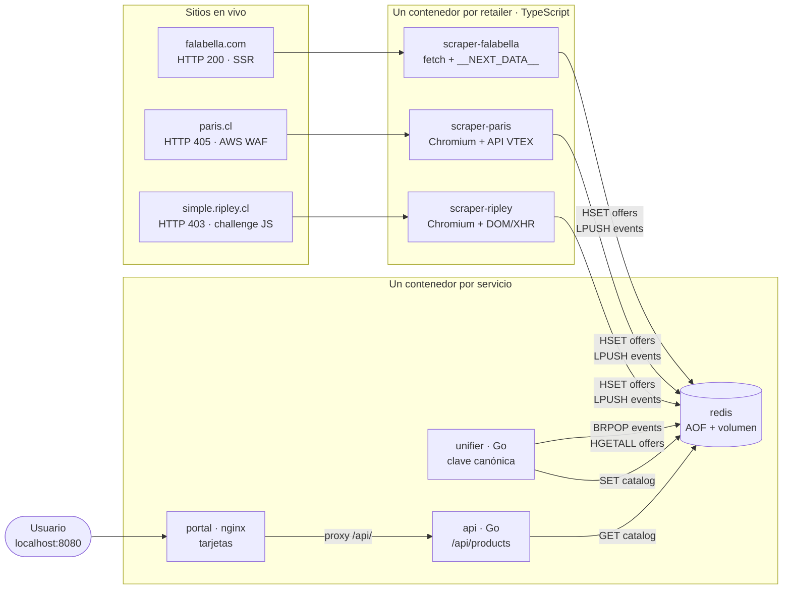

# ChileCompara

Comparador de precios de smartphones para el mercado chileno. Obtiene productos
en vivo desde **Falabella, Paris y Ripley**, reconoce cuándo un mismo teléfono
aparece en más de una tienda aunque cada sitio lo nombre distinto, y lo muestra
en una sola pantalla con el precio de cada retailer y el más barato destacado.

Todo corre local con un comando. Sin nube, sin cuentas, sin claves.

```bash
docker compose up --build
```

Luego abre **http://localhost:8080**.

La API queda en `http://localhost:8081/api/products` por si quieres ver el JSON
crudo, y `http://localhost:8081/api/status` dice qué scraper respondió y cuál no.

---

## Qué problema resuelve

El mismo teléfono cuesta distinto en cada retailer, y hoy no hay forma de verlo
sin abrir tres pestañas y comparar a mano títulos que nunca coinciden: uno lo
llama `Celular Galaxy S25 Ultra 256GB`, otro `Samsung Galaxy S25 Ultra 256 GB
Negro Titanio`. El trabajo duro no es bajar precios: es **decidir que esos dos
títulos son el mismo producto**, y hacerlo con reglas que también funcionen con
un teléfono que salga al mercado mañana.

---

## Arquitectura



**Flujo punta a punta.** Cada scraper obtiene el catálogo de su tienda y escribe
sus ofertas crudas en el hash `offers` de Redis, con la clave
`{retailer}:{sku}`; luego empuja el nombre del retailer a la lista `events`. El
`unifier` está bloqueado en `BRPOP events`: en cuanto llega un evento (o cada 5
segundos, si no llega ninguno) relee **todas** las ofertas, calcula la identidad
canónica de cada una, las agrupa y guarda el catálogo ya resuelto en la clave
`catalog`. La `api` sólo lee esa clave y la sirve; el `portal` es nginx con HTML
estático que hace `fetch` cada 10 segundos y hace de proxy hacia la API para que
el navegador vea un único origen.

**Los 7 nodos.** `redis` · `scraper-falabella` · `scraper-paris` ·
`scraper-ripley` · `unifier` · `api` · `portal`. Ningún contenedor mezcla dos
retailers ni dos responsabilidades: el que raspa no unifica, el que unifica no
sirve HTTP, y el que sirve la web no habla con Redis.

---

## Decisiones y por qué

### 1. Qué sitio necesita navegador, y por qué

Se midió antes de decidir nada, con `curl` y un User-Agent de Chrome:

| Sitio | Respuesta real | Necesita navegador |
|---|---|---|
| `falabella.com` | **HTTP 200**, 2.5 MB de HTML con `__NEXT_DATA__` y 56 productos dentro | **No** |
| `paris.cl` | **HTTP 405** + `<title>Human Verification</title>` con `window.gokuProps` y `awsWafCookieDomainList` | **Sí** |
| `simple.ripley.cl` | **HTTP 403**, shell `<html class="no-js">` de 140 KB, cero markup de producto | **Sí** |

Son **dos**, no uno. Falabella se libra porque renderiza en el servidor con
Next.js y deja el catálogo entero serializado en el HTML: un GET basta. Paris
tiene AWS WAF delante del dominio completo — el interstitial aparece igual en la
API de VTEX, en el sitemap y en el árbol de categorías, así que no es cuestión
de encontrar el endpoint correcto. Ripley devuelve un cascarón cuyo contenido
sólo existe después de ejecutar su JavaScript.

### 2. En Paris se pide el JSON, no se raspa el DOM

Una vez que Chromium resolvió el desafío de AWS WAF, el scraper **no** lee la
página: llama a la API de catálogo de VTEX *desde dentro de la página*, que ya
lleva la cookie del WAF. Se obtienen `brand`, `productId` y precio como campos
estructurados en vez de texto sacado de un maquetado que cambia solo. El
navegador se usa para pasar la puerta, no para leer.

### 3. La unificación no tiene una sola regla por producto

La clave canónica es `marca | modelo | almacenamiento | condición`. Todo lo que
la construye es un vocabulario de **atributos** — marcas, colores, ruido
comercial, unidades de ficha técnica — nunca una lista de modelos. Un teléfono
que no existe todavía se normaliza igual que uno conocido, y hay un test que lo
comprueba con un producto inventado.

Cuatro decisiones concretas, cada una nacida de un dato medido en el catálogo
real, no de una intuición:

- **La marca sale del campo estructurado, no del título.** El **27 %** de los
  títulos no contiene ningún token de marca (`Celular 15T 512GB`, `Celular Edge
  60 256GB`), y extraerla del texto fabricaba marcas falsas como `15t` o `edge`.
  El `brand` estructurado está presente en el **100 %** de los productos.
- **El almacenamiento es el máximo de las capacidades, no la primera.** Los
  títulos mezclan RAM y ROM en cualquier orden: `8GB RAM+ 256GB Memoria` y
  `256GB (12GB RAM)` conviven en el mismo catálogo. Quedarse con el primer match
  devolvía 8 GB para un teléfono de 256 GB — un dato falso *y* una clave partida.
- **La condición entra en la clave.** El **7 %** del catálogo es reacondicionado.
  Si colapsa con el producto nuevo, el portal anuncia un "más barato" que el
  usuario no puede comprar. Eso no es un bug de formato: destruye la única
  promesa que hace la pantalla.
- **Las ofertas sin capacidad se adhieren, pero sólo si no hay ambigüedad.** El
  **16 %** de los títulos no declara almacenamiento — y son justo los iPhone,
  que Falabella lista como `IPhone 17` a secas. Esas ofertas se unen al grupo que
  comparte marca, modelo y condición **si hay exactamente un candidato**. Con dos
  (256 GB y 512 GB) la oferta es genuinamente ambigua y se deja aparte: dos
  tarjetas separadas es honesto, adivinar no lo es.

### 4. Nunca se compara un precio con tarjeta de la tienda

Falabella publica `cmrPrice` y Ripley un precio "Tarjeta Ripley": exigen
contratar un producto financiero de esa misma tienda. Compararlos contra el
precio al contado de otra tienda inventa un ahorro que no existe. Se usa el
precio al contado (`internetPrice` / `eventPrice`, o el de oferta) y nada más.
Es una decisión de negocio, no de parsing.

### 5. Falabella se sirve en ISO-8859-1

La página declara `<meta charSet="iso-8859-1">`. Decodificarla como UTF-8
convierte `Batería` en `Bater?a` y contamina los títulos, que son exactamente la
materia prima de la unificación. El scraper decodifica en `latin1`.

### 6. El catálogo se reconstruye entero en cada evento

Son unos cientos de filas: recalcular todo cuesta lo mismo que actualizar
incremental y elimina de raíz los bugs de estado parcial — la oferta retirada que
sobrevive, el precio viejo que gana. La complejidad se paga en la demo.

### 7. Un retailer bloqueado se muestra, no se esconde

Si un scraper no consigue datos, su contenedor sigue de pie, registra el motivo
en Redis y el portal lo dice en su cabecera. Un nodo caído es información para el
usuario, no algo que ocultar detrás de una pantalla vacía.

---

## Verificación

```bash
# Tests de unificación (no requiere Go instalado)
docker run --rm -v "$(pwd)/unifier:/src" -w /src golang:1.23-alpine go test -v ./...

# Qué respondió cada retailer
curl -s localhost:8081/api/status

# Persistencia: el catálogo sobrevive al reinicio de Redis
docker compose restart redis && sleep 5 && curl -s localhost:8081/api/products | head -c 200
```

---

## Limitaciones conocidas

*(sección completada tras la verificación final — ver más abajo)*
