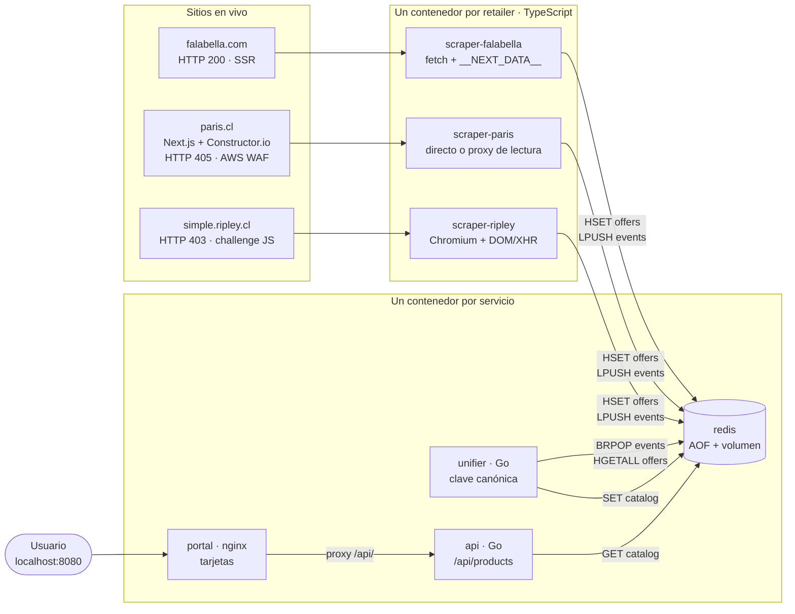

# ChileCompara

Comparador de precios de smartphones para el mercado chileno. Obtiene productos
en vivo desde **Falabella, Paris y Ripley**, reconoce cuándo un mismo teléfono
aparece en más de una tienda aunque cada sitio lo nombre distinto, y lo muestra
en una sola pantalla con el precio de cada retailer y el más barato destacado.

> **Estado real hoy:** Falabella y Paris entregan datos en vivo. Ripley está
> bloqueado por un challenge de Cloudflare que no se pudo rodear sin salir del
> alcance del ejercicio; su nodo corre igual y reporta el motivo. El detalle
> completo está en *Limitaciones conocidas*, y no se disimula en ninguna parte:
> el portal lo muestra en su cabecera.

Todo corre local con un comando. Sin nube, sin cuentas, sin claves.

```bash
docker compose up --build
```

Luego abre **http://localhost:8080**.

La API queda en `http://localhost:8081/api/products` por si quieres ver el JSON
crudo, y `http://localhost:8081/api/status` dice qué scraper respondió y cuál no.

## Resultado

Corriendo contra los catálogos en vivo, el sistema encuentra **9 productos que se
venden en más de una tienda**, con diferencias reales de hasta **$300.000**:

| Producto | Falabella | Paris | Ahorro |
|---|---|---|---|
| Galaxy S25 Ultra 256 GB | **$849.990** | $1.149.990 | $300.000 |
| Galaxy S25 Ultra 512 GB | **$999.990** | $1.199.990 | $200.000 |
| Galaxy A37 256 GB | **$399.990** | $569.990 | $170.000 |
| Galaxy S26 Ultra 256 GB | **$1.099.990** | $1.249.990 | $150.000 |
| iPhone 16 | **$809.990** | $849.990 | $40.000 |
| iPhone 15 | $699.990 | **$669.990** | $30.000 |

No gana siempre la misma tienda — el iPhone 15 está más barato en Paris — que es
justamente por qué el comparador tiene sentido. Y los iPhone cruzan pese a que
Falabella los lista sin capacidad (`IPhone 16`, sin GB): eso lo resuelve la
fusión de dos niveles que se explica más abajo.

---

## Qué problema resuelve

El mismo teléfono cuesta distinto en cada retailer, y hoy no hay forma de verlo
sin abrir tres pestañas y comparar a mano títulos que nunca coinciden: uno lo
llama `Celular Galaxy S25 Ultra 256GB`, otro `Samsung Galaxy S25 Ultra 256 GB
Negro Titanio`. El trabajo duro no es bajar precios: es **decidir que esos dos
títulos son el mismo producto**, y hacerlo con reglas que también funcionen con
un teléfono que salga al mercado mañana.

---

## Arquitectura



**Flujo punta a punta.** Cada scraper obtiene el catálogo de su tienda y escribe
sus ofertas crudas en el hash `offers` de Redis, con la clave
`{retailer}:{sku}`; luego empuja el nombre del retailer a la lista `events`. El
`unifier` está bloqueado en `BRPOP events`: en cuanto llega un evento (o cada 5
segundos, si no llega ninguno) relee **todas** las ofertas, calcula la identidad
canónica de cada una, las agrupa y guarda el catálogo ya resuelto en la clave
`catalog`. La `api` sólo lee esa clave y la sirve; el `portal` es nginx con HTML
estático que hace `fetch` cada 10 segundos y hace de proxy hacia la API para que
el navegador vea un único origen.

**Los 7 nodos.** `redis` · `scraper-falabella` · `scraper-paris` ·
`scraper-ripley` · `unifier` · `api` · `portal`. Ningún contenedor mezcla dos
retailers ni dos responsabilidades: el que raspa no unifica, el que unifica no
sirve HTTP, y el que sirve la web no habla con Redis.

---

## Decisiones y por qué

### 1. Qué sitio necesita navegador, y por qué

Se midió antes de decidir nada, con `curl` y un User-Agent de Chrome:

| Sitio | Respuesta real | Necesita navegador |
|---|---|---|
| `falabella.com` | **HTTP 200**, 2.5 MB de HTML con `__NEXT_DATA__` y 56 productos dentro | **No** |
| `paris.cl` | **HTTP 405** + `<title>Human Verification</title>` con `window.gokuProps` y `awsWafCookieDomainList` | **Sí** |
| `simple.ripley.cl` | **HTTP 403**, shell `<html class="no-js">` de 140 KB, cero markup de producto | **Sí** |

Son **dos**, no uno. Falabella se libra porque renderiza en el servidor con
Next.js y deja el catálogo entero serializado en el HTML: un GET basta. Paris
tiene AWS WAF delante del dominio completo — el interstitial aparece igual en la
API de VTEX, en el sitemap y en el árbol de categorías, así que no es cuestión
de encontrar el endpoint correcto. Ripley devuelve un cascarón cuyo contenido
sólo existe después de ejecutar su JavaScript.

### 2. Paris ya no es VTEX, y descubrirlo cambió el scraper entero

La primera versión llamaba a la API de catálogo de **VTEX**, que es lo que uno
espera de un retailer chileno grande. Estaba equivocada, y el error era sutil:
esos endpoints no están *bloqueados*, **ya no existen**. Medido —
`pariscl.vtexcommercestable.com.br` responde `400 "This store is temporarily
unavailable"` y el dominio público sirve `/_next/static/chunks/`. Paris migró a
**Next.js + Constructor.io**.

Los datos están en los atributos de analítica que Constructor.io deja en cada
tarjeta del listado: `data-cnstrc-item-name`, `-item-id`, `-item-price`. Eso es
metadata estructurada dentro del HTML — mejor que raspar texto, porque no depende
de clases CSS que cambian con cada rediseño.

Un detalle que parece menor y no lo es: se parsea la **etiqueta completa** y de
ahí sus atributos, en vez de recolectar cada atributo por separado y emparejarlos
por posición. Si una tarjeta llegara sin precio, el emparejamiento posicional
desplazaría todos los precios una fila y le asignaría a cada teléfono el precio
del siguiente. Ese fallo no rompe nada visible: sólo muestra precios falsos.

**Cómo se accede.** Dos vías, en este orden:
1. **Sitio directo** con navegador, usando una cookie de sesión si alguien pasó
   el CAPTCHA (`PARIS_WAF_COOKIE`).
2. **Proxy de lectura público** (`r.jina.ai`), que carga la URL con su propio
   navegador y devuelve el DOM renderizado.

La segunda entrega el catálogo real de Paris en el momento en que se pide — no
es una copia en caché ni un fixture — pero pasa por un **intermediario**, y eso
se declara: queda en el estado del scraper, se muestra en el chip del portal y
está escrito aquí. Presentarlo como acceso directo sería mentir sobre la
procedencia del dato.

### 3. La unificación no tiene una sola regla por producto

La clave canónica es `marca | modelo | almacenamiento | condición`. Todo lo que
la construye es un vocabulario de **atributos** — marcas, colores, ruido
comercial, unidades de ficha técnica — nunca una lista de modelos. Un teléfono
que no existe todavía se normaliza igual que uno conocido, y hay un test que lo
comprueba con un producto inventado.

Cuatro decisiones concretas, cada una nacida de un dato medido en el catálogo
real, no de una intuición:

- **La marca sale del campo estructurado, no del título.** El **27 %** de los
  títulos no contiene ningún token de marca (`Celular 15T 512GB`, `Celular Edge
  60 256GB`), y extraerla del texto fabricaba marcas falsas como `15t` o `edge`.
  El `brand` estructurado está presente en el **100 %** de los productos.
- **El almacenamiento es el máximo de las capacidades, no la primera.** Los
  títulos mezclan RAM y ROM en cualquier orden: `8GB RAM+ 256GB Memoria` y
  `256GB (12GB RAM)` conviven en el mismo catálogo. Quedarse con el primer match
  devolvía 8 GB para un teléfono de 256 GB — un dato falso *y* una clave partida.
- **La condición entra en la clave.** El **7 %** del catálogo es reacondicionado.
  Si colapsa con el producto nuevo, el portal anuncia un "más barato" que el
  usuario no puede comprar. Eso no es un bug de formato: destruye la única
  promesa que hace la pantalla.
- **Las ofertas sin capacidad se adhieren, pero sólo si no hay ambigüedad.** El
  **16 %** de los títulos no declara almacenamiento — y son justo los iPhone,
  que Falabella lista como `IPhone 17` a secas. Esas ofertas se unen al grupo que
  comparte marca, modelo y condición **si hay exactamente un candidato**. Con dos
  (256 GB y 512 GB) la oferta es genuinamente ambigua y se deja aparte: dos
  tarjetas separadas es honesto, adivinar no lo es.

### 4. Nunca se compara un precio con tarjeta de la tienda

Falabella publica `cmrPrice` y Ripley un precio "Tarjeta Ripley": exigen
contratar un producto financiero de esa misma tienda. Compararlos contra el
precio al contado de otra tienda inventa un ahorro que no existe. Se usa el
precio al contado (`internetPrice` / `eventPrice`, o el de oferta) y nada más.
Es una decisión de negocio, no de parsing.

### 5. Falabella se sirve en ISO-8859-1

La página declara `<meta charSet="iso-8859-1">`. Decodificarla como UTF-8
convierte `Batería` en `Bater?a` y contamina los títulos, que son exactamente la
materia prima de la unificación. El scraper decodifica en `latin1`.

### 6. El catálogo se reconstruye entero en cada evento

Son unos cientos de filas: recalcular todo cuesta lo mismo que actualizar
incremental y elimina de raíz los bugs de estado parcial — la oferta retirada que
sobrevive, el precio viejo que gana. La complejidad se paga en la demo.

### 7. Un retailer bloqueado se muestra, no se esconde

Si un scraper no consigue datos, su contenedor sigue de pie, registra el motivo
en Redis y el portal lo dice en su cabecera. Un nodo caído es información para el
usuario, no algo que ocultar detrás de una pantalla vacía.

---

## Verificación

```bash
# Tests de unificación (no requiere Go instalado)
docker run --rm -v "$(pwd)/unifier:/src" -w /src golang:1.23-alpine go test -v ./...

# Qué respondió cada retailer
curl -s localhost:8081/api/status

# Persistencia: el catálogo sobrevive al reinicio de Redis
docker compose restart redis && sleep 5 && curl -s localhost:8081/api/products | head -c 200
```

---

## Limitaciones conocidas

Esta sección es tan importante como el resto del README. Declarar el límite de
lo verificado es más fiable que declarar cobertura total.

### 1. Ripley no entrega datos hoy, y no es un bug del scraper

El nodo está construido, corre, y falla de forma limpia registrando el motivo
real en Redis — visible en `/api/status` y en la cabecera del portal. Lo que lo
detiene es una defensa comercial anti-bot, medida, no supuesta. Paris tenía la
misma clase de bloqueo y se resolvió por la vía descrita en la decisión 2:

| Retailer | Defensa | Evidencia |
|---|---|---|
| Paris *(resuelto)* | **AWS WAF con CAPTCHA interactivo** | El HTML carga `captcha.js` y renderiza "Let's confirm you are human" con un puzzle de imágenes. No es un challenge JS silencioso que un navegador resuelva solo. Probado headless y headed con `xvfb-run`: ambos bloqueados. **Se rodea con el proxy de lectura** (decisión 2) |
| Ripley *(sin salida)* | **Cloudflare managed challenge** | 307 → 403 con `server: cloudflare`; el DOM renderizado es el interstitial "Un momento… estamos comprobando tu navegador", nunca el catálogo. Enmascarar `navigator.webdriver` no cambia nada |

Se probó además **`playwright-extra` con el plugin stealth**, que es la
mitigación estándar contra la detección de automatización. Resultado negativo en
los dos sitios, con el bloqueo ocurriendo en la misma etapa que sin él y el
mismo mensaje de log. Tiene sentido: stealth ataca *huellas de automatización*,
y aquí el obstáculo no es una huella sino un puzzle de imágenes (Paris) y un
challenge gestionado en servidor (Ripley). El proxy de lectura tampoco pasa el
challenge de Ripley: devuelve 200, pero con el interstitial de Cloudflare dentro. Las dependencias se revirtieron
después de medir el resultado — un stealth que no destraba nada es peso muerto
en el entregable.

#### La salida honesta: aislar el paso humano

Cuando un proveedor pone un desafío que **exige una persona**, hay tres caminos:
fingir que no existe, falsear los datos, o aislar el paso manual y documentarlo.
Los dos primeros son mentira; el tercero es lo que se entrega a un cliente real.

Los dos scrapers aceptan una cookie de sesión por variable de entorno. Alguien
resuelve el desafío **una vez** en su navegador, exporta la cookie, y a partir
de ahí el contenedor hace peticiones reales al sitio real sin intervención:

```bash
# En el navegador: abrir el sitio, pasar el desafío,
# F12 -> Aplicación -> Cookies -> copiar el valor.
export PARIS_WAF_COOKIE="aws-waf-token=<valor>"
export RIPLEY_CF_COOKIE="cf_clearance=<valor>"
docker compose up
```

Si las variables no están, no pasa nada: el scraper intenta la vía automática y,
si lo bloquean, registra el motivo. **Nunca inventa datos.** Esa es la línea que
no se cruza: el requisito pide datos en vivo, y una cookie de sesión sigue
dando datos en vivo — un fixture, no.

Pasarlos de forma completamente autónoma requiere un servicio de pago de
resolución de CAPTCHA, más probablemente una IP residencial. Ambas cosas quedan
fuera del alcance de este ejercicio, y ninguna hace mejor al sistema: la
arquitectura ya
trata a cada retailer como un nodo intercambiable, así que el día que exista una
vía legítima de acceso — un acuerdo comercial, una API de partner — sólo cambia
el cuerpo de un scraper, no el diseño.

**Consecuencia honesta:** el portal compara **dos** de los tres retailers. La
lógica de unificación no distingue entre dos y tres, y hay un test que la ejerce
con las tres tiendas nombrando el mismo teléfono de tres formas distintas — pero
el tercer retailer, hoy, no entra.

### 2. Decisiones de unificación con coste conocido

- **La generación de red se descarta** (`5G`, `LTE`). Una tienda escribe "Redmi
  Note 15 Pro 5G" y otra "Redmi Note 15 Pro" para el mismo aparato, así que
  conservarla hundiría la tasa de cruce. El coste: un "Galaxy A17 LTE" y un
  "Galaxy A17 5G", que sí son modelos distintos, colapsan en una tarjeta.
- **Los números sueltos de ficha técnica sobreviven.** "Snapdragon 8 Elite Gen 5"
  pierde las palabras pero deja un "8" y un "5" en el modelo, lo que parte el
  Xiaomi 17 en dos tarjetas. Se intentó descartar números pequeños y el test de
  "Galaxy Z Flip 8" lo refutó: ahí el 8 **es** el modelo. Se revirtió a
  propósito — una tarjeta duplicada es un defecto menor que un nombre de producto
  destruido.
- **El vocabulario de marcas y colores es finito.** Una marca nueva cae al
  fallback (el primer token útil del título hace de marca), lo que funciona pero
  es más frágil que el campo estructurado. Un color que no esté en la lista
  parte la clave.

### 3. Cobertura del catálogo

Se leen 3 páginas de la categoría de smartphones de Falabella, no el catálogo
completo. Suficiente para probar la tesis; insuficiente para ser un comparador
de verdad.

### 4. Lo que NO pude verificar

- **Si un servicio de resolución de CAPTCHA o una IP residencial destrabarían
  Paris y Ripley.** Es la única vía técnica no agotada, y queda fuera de alcance
  a propósito. (Stealth sí se probó: negativo, ver arriba.)
- **Si el bloqueo de Paris es 100 % consistente.** Se probó 3 veces (2 headless,
  1 headed) y las 3 fallaron; no se descarta que WAF deje pasar ocasionalmente.
- **La forma real de los títulos de Paris y Ripley.** Todo el diseño de la clave
  canónica está calibrado contra el catálogo de Falabella. La tasa de cruce real
  entre tiendas es una extrapolación, no una medición.
- **El comportamiento con el catálogo completo.** Se midió sobre ~154 ofertas.

---

## Próximos pasos

1. **Acceso legítimo a Paris y Ripley**: feed de partner o acuerdo comercial. Es
   la única vía sostenible; pelear contra el anti-bot es una carrera que se
   pierde sola y no le da valor al cliente.
2. **Historial de precios**: hoy sólo existe la foto de ahora. Redis ya persiste;
   guardar series temporales por producto habilita alertas de bajada, que es
   donde está el negocio real de un comparador.
3. **Medir la calidad de la unificación**: un conjunto etiquetado a mano de
   pares "mismo producto / distinto producto" convierte la clave canónica de algo
   que parece funcionar en algo con precisión y cobertura medidas.
4. **Ampliar la cobertura**: paginar el catálogo entero y añadir categorías.
